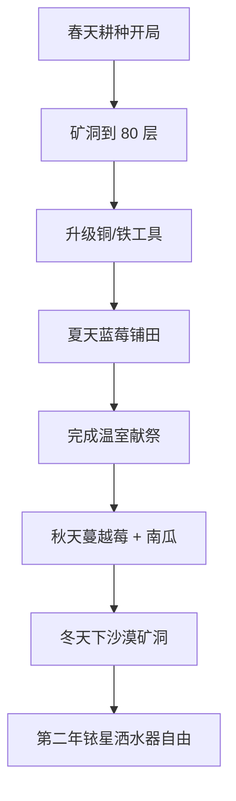

# 星露谷物语 新手四季开荒攻略

## 春天 · Year 1

春季是打基础的季节，前几天的节奏直接决定第一年的进度。

1. 第一天清空背包，**砍树 + 割草**攒材料
2. 第 2-5 天种下**防风草**，浇水不能断
3. 第 5 天矿洞开放后，每天下 5 层
4. 第 13 日**复活节**买草莓种子 — 春季最赚钱作物

::tip:: 复活节草莓种子记得留到下一年春天！第一年买了可以先种一波应急资金。

## 四季核心作物排名

| 季节   | 作物       | 收益/天 | 备注                     |
| ------ | ---------- | ------- | ------------------------ |
| 春天   | 草莓       | 20g+    | 复活节限定购买           |
| 春天   | 土豆       | 8g      | 可能一次收多个           |
| 夏天   | 蓝莓       | 20g+    | 一次收 3 颗，持续产出    |
| 夏天   | 杨桃       | 26g     | 绿洲购买，酿酒翻三倍     |
| 秋天   | 蔓越莓     | 18g+    | 类似蓝莓，多产           |
| 秋天   | 南瓜       | 16g     | 巨大作物可能             |
| 冬天   | 野种       | —       | 唯一能种的东西           |

## 第一年核心目标路线



::timeline:: 第一年里程碑
- **春 1-12**：锄地种防风草，攒 2000g 买背包
- **春 13**：复活节 All in 草莓
- **春末**：矿洞冲 80 层，做优质洒水器
- **夏**：蓝莓铺满，建鸡舍/畜棚
- **秋**：蔓越莓收菜流，完成温室献祭
- **冬**：沙漠矿洞炸铱矿，升级全部工具

## 赚钱流派对比

### 1. 酿酒流（推荐新手）

最稳定的后期收入来源。杨桃酒 > 远古水果酒 > 啤酒花淡啤酒。

```
温室 + 姜岛 → 远古水果 → 小桶酿酒 → 木桶陈酿（铱星）
日收入：约 10,000g ~ 30,000g
```

### 2. 养猪流

松露油一本万利，但需要大量投资。

```
豪华畜棚 × 2 → 24 只猪 → 每日捡松露 → 榨油机
冬季猪不出门，收益归零
```

### 3. 绵羊流（前期友好）

织布机 + 牧羊人技能，不需要加工。

```
豪华畜棚 → 12 只绵羊 → 自动抚摸机 → 每日收布
稳定但上限不如酿酒
```

## 社区中心 vs Joja 路线

- **社区中心**：献祭流，体验完整游戏内容，温室 + 矿车 + 沙漠巴士逐步解锁
- **Joja 会员**：纯金币流，适合速通或多周目老玩家

::tip:: 首推社区中心路线！献祭过程会带你熟悉所有游戏机制，而且不额外花钱。
